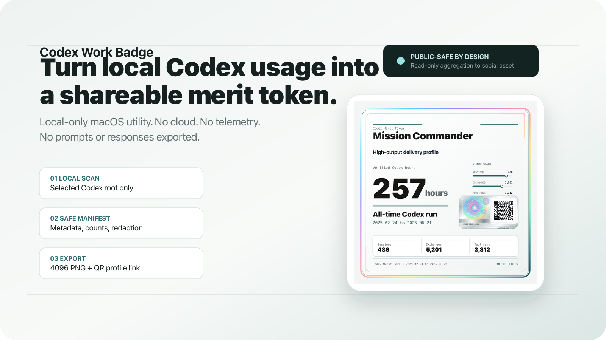

# Codex Work Badge



Codex Work Badge is a local-only macOS app that scans a user-selected Codex
root, aggregates usage metadata, and exports a square merit-token PNG for
sharing.

The app is built for people who want a public, social-ready summary of their
Codex work without uploading their transcripts or leaking local context.

## Project Links

- Maintainer: [Anthony Di Benedetto](https://x.com/anthonydibe)
- Repository: [AI-adb/codex-work-badge](https://github.com/AI-adb/codex-work-badge)
- License: [MIT](LICENSE)

## Highlights

- Local-only Codex usage scan.
- Read-only parser for Codex SQLite and rollout JSONL metadata.
- Public-safe badge manifest with forbidden-data checks.
- 1:1 merit-token preview and 4096x4096 PNG export.
- A scannable profile QR code.
- Native macOS Save and Copy Image actions in the Tauri app.

## Requirements

- macOS for the desktop app and DMG build.
- Node.js 22 or newer.
- Rust/Cargo for Tauri packaging.

## Quick Start

```bash
npm install
npm run dev
```

Open `http://127.0.0.1:5173`.

## Common Commands

| Command | Purpose |
| --- | --- |
| `npm run dev` | Start the local Vite preview. |
| `npm run doctor` | Check privacy boundaries and public manifest safety. |
| `npm run test` | Run parser, manifest, privacy, QR and export tests. |
| `npm run qa` | Render and validate exact `1080x1080` and `4096x4096` PNG assets. |
| `npm run build` | Run doctor, tests, typecheck and Vite build. |
| `npm run dmg` | Build a local unsigned macOS DMG. |

## Verification

```bash
npm run doctor
npm run test
npm run qa
npm run build
```

For browser interaction QA, start Chrome with remote debugging:

```bash
open -na "Google Chrome" --args --remote-debugging-port=9223 --user-data-dir=/tmp/codex-work-badge-chrome http://127.0.0.1:5173
CODEX_BADGE_CDP=http://127.0.0.1:9223 npm run browser-qa
```

## Build the Mac App

```bash
npm run dmg
```

The DMG is unsigned and not notarized. Apple Developer ID signing and
notarization are intentionally separate distribution steps.

## Privacy and Security Model

The app is designed around a strict privacy boundary:

- no cloud backend;
- no telemetry;
- no social API posting;
- no prompt or response export;
- no global home-directory scan;
- no local path, thread id, email, secret, token, or exact timestamp in the
  public badge manifest.

The native scanner reads only the Codex root selected by the user. It parses
`sqlite/state_5.sqlite` and rollout JSONL paths referenced by that database,
then aggregates counts and durations. The public badge is produced from a
restricted manifest, not raw transcripts.

Manual outcome counts, such as resolved bugs or shipped artifacts, must come
from a verified public-safe ledger. They are never inferred from transcripts.

## What Gets Counted

- Sessions and available date range from the Codex thread database.
- User and assistant message counts from rollout metadata.
- Tool call counts from rollout events.
- Active minutes from bounded task duration events.
- Manual public-safe outcomes only when provided by the verified ledger.

## Status

The current public release includes the local app source, native Tauri scanner,
privacy doctor, unit tests, visual export QA, browser interaction QA and a local
DMG builder.

The canonical behavior ledger lives in
`docs/qa/codex-work-badge-user-stories.csv`.

## Distribution Note

This is an early public release. The generated DMG is for direct local testing
and is not Apple Developer ID signed or notarized yet.
